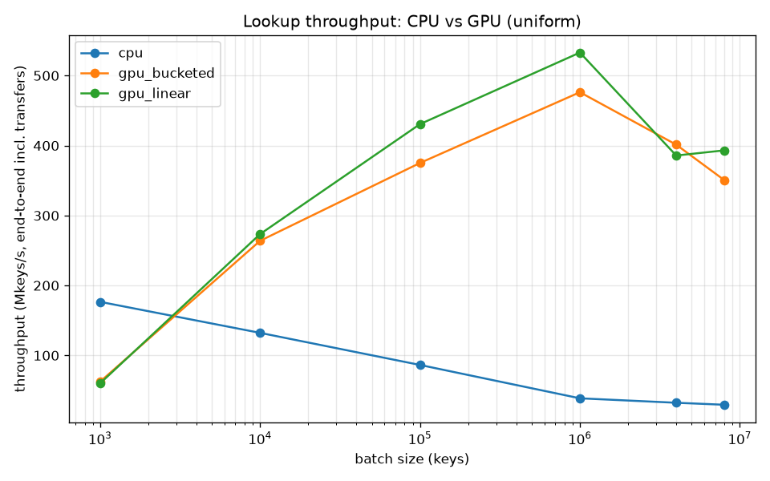
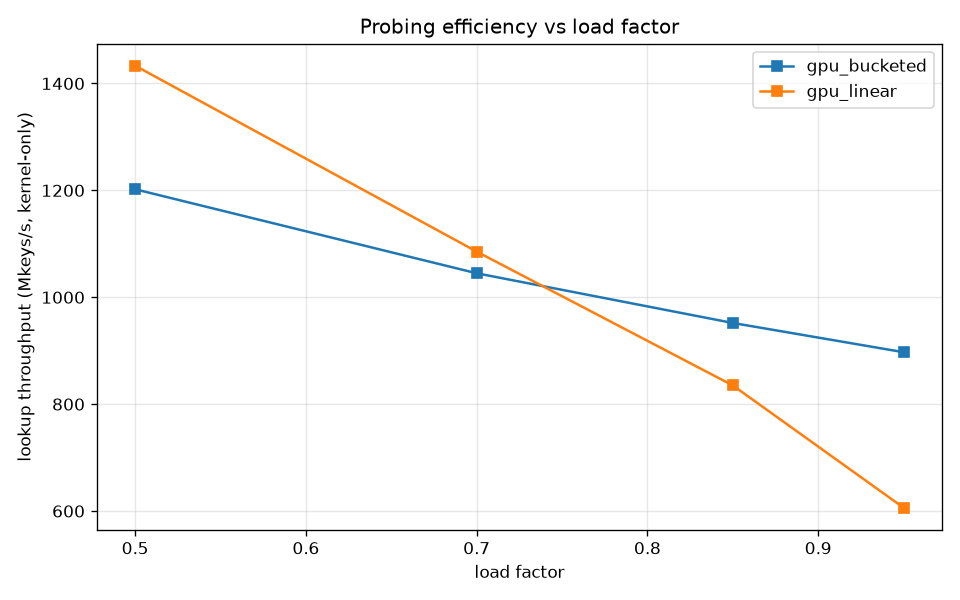

# GPU-Accelerated Key-Value Cache


A GPU-resident, open-addressing hash table in CUDA C++ that serves batched
`PUT`/`GET` across thousands of threads, using atomic operations for concurrent
inserts. It ships with two complementary table designs, a rigorous benchmark
against `std::unordered_map` that pinpoints the CPU↔GPU parallelism crossover,
and a CUDA-streams pipeline that overlaps host–device transfers with kernel
execution. Everything is measured on real hardware (RTX 4060 Ti) and profiled
with Nsight.

> **TL;DR results** (NVIDIA GeForce RTX 4060 Ti, CUDA 13.3):
> - **>13×** end-to-end lookup throughput vs `std::unordered_map` at large batches; crossover at **~3–4K keys**.
> - **~46×** insert throughput via concurrent `atomicCAS`.
> - **1.76×** speedup from overlapping PCIe transfers with kernels using CUDA streams + pinned memory.
> - A measured **load-factor crossover at ~0.8** where the warp-cooperative table overtakes thread-per-key (+48% at LF 0.95).



## Why this design

Open addressing (rather than chaining) keeps the table in flat, contiguous device
arrays — no pointer chasing, which is what GPUs are worst at. Storage is
**structure-of-arrays** (`keys[]` and `values[]` separate) so that probing scans
keys with coalesced, cache-line-friendly accesses. Keys and values are 64-bit;
`0xFFFF…FF` is reserved as the empty sentinel so a fresh table is one
`cudaMemset`. Semantics are cache-like: re-inserting a key overwrites its value.

Two implementations share one API so the benchmark can swap them in place:

| | `LinearProbeTable` | `BucketedTable` |
|---|---|---|
| Granularity | one **thread** per key | one **warp** per key |
| Probing | linear over flat slots | linear over 32-slot **buckets** |
| Memory access | scalar loads while probing | full bucket loaded coalesced; 32 lanes inspect it together |
| Concurrency primitive | `atomicCAS` per slot | `__ballot_sync` + `__shfl_sync` + `atomicCAS` by an elected lane |
| Best regime | low load factor (short chains) | high load factor (bounded probe length, better coalescing) |

The warp-cooperative bucketed design is the approach used by NVIDIA's own
[cuCollections (`cuco`)](https://github.com/NVIDIA/cuCollections) library; here it
is implemented from scratch to show the mechanics, and benchmarked head-to-head
with the simpler design to make the trade-off concrete rather than assumed.

### Concurrency correctness

Insert is the interesting case. Each thread (or warp) computes `hash(key)` and
linear-probes. To claim a slot it issues `atomicCAS(&keys[slot], kEmpty, key)`:

- `prev == kEmpty` → we won an empty slot; write the value.
- `prev == key`  → the key already exists (possibly just inserted by another
  thread); overwrite the value (last-writer-wins, which is correct for a cache).
- otherwise      → a different key owns the slot; probe the next one.

In the bucketed table, a failed CAS triggers a **re-read of the bucket** rather
than blindly advancing, so a concurrent same-key insert is caught by the match
test and we never create duplicate keys. The test suite cross-checks both tables
against `std::unordered_map` across inserts, updates, hits, and misses.

## Usage

Both tables expose the same small API (see [`include/gpu_hash_table.cuh`](include/gpu_hash_table.cuh)).
Operations are batched, take **device** pointers, and launch asynchronously on the
supplied stream:

```cpp
#include "gpu_hash_table.cuh"
using namespace gpukv;

// Provision capacity >= 2 * num_keys to keep the load factor <= 0.5.
BucketedTable table(/*capacity=*/2 * n);     // or LinearProbeTable for sparse tables

table.insert(d_keys, d_values, n);           // batched PUT (concurrent atomicCAS)
table.find(d_query, d_out, q);               // batched GET
cudaDeviceSynchronize();                     // ops are async; sync before reading back

// d_out[i] == kNotFound marks a miss; re-inserting a key overwrites its value.
```

`./build/demo` is a complete, runnable version of the above. Reach for
`LinearProbeTable` when the table stays sparse (load factor ≤ ~0.7) and
`BucketedTable` when it runs fuller — see the [load-factor crossover](#results-highlights) below.

## Results highlights

See [`docs/RESULTS.md`](docs/RESULTS.md) for the full analysis, methodology, and
raw tables. The headline findings:

- **Crossover (§1).** The GPU loses below ~3–4K keys (kernel-launch + PCIe
  latency dominate) and wins by >13× above ~1M keys.
- **Transfers dominate (§2).** At 8M keys, 61% of end-to-end lookup time is
  H2D+D2H copies, not the kernel — which is exactly why the streamed pipeline
  exists.
- **Load-factor crossover (§4).** Thread-per-key is fastest while the table is
  sparse; the bucketed table wins once it fills past ~0.8 because it bounds probe
  length and loads each bucket in one coalesced transaction.

  

- **Stream overlap (§5).** Splitting the batch across 4 streams with pinned host
  memory hides transfers behind compute for a 1.76× wall-clock speedup, verified
  in the Nsight Systems timeline.
- **Unified Memory costs (§6).** Explicit pinned transfers beat `cudaMallocManaged`
  at every batch size — naive demand-paging is ~1.7× slower and even with
  `cudaMemPrefetchAsync` hints it still trails by ~1.3×, quantifying the price of
  the convenience.

## Build & run

Requirements: CUDA Toolkit (tested 13.3), CMake ≥ 3.20, a C++17 host compiler,
and an NVIDIA GPU. Defaults target `sm_89`; override for your GPU, e.g.
`-DCMAKE_CUDA_ARCHITECTURES=86` (Ampere) or `=native`.

```bash
cmake -B build -DCMAKE_BUILD_TYPE=Release
cmake --build build -j

ctest --test-dir build --output-on-failure   # correctness
./build/demo                                  # tiny usage example
./scripts/run_benchmark.sh                    # full sweep + plots
```

Individual tools:

```bash
./build/benchmark results/benchmark.csv   # CPU vs GPU sweep + load-factor study
./build/streams_benchmark                 # synchronous vs streamed overlap
./build/unified_memory_benchmark          # explicit pinned vs Unified Memory
./build/profile_kernels                   # minimal driver for Nsight Compute
```

## Profiling

```bash
./scripts/profile_nsys.sh   # Nsight Systems timeline (no special perms needed)
./scripts/profile_ncu.sh    # Nsight Compute kernel metrics (needs counter access)
```

Nsight Compute needs GPU performance-counter access; if you see `ERR_NVGPUCTRPERM`
the script header documents the one-time fix.

## Project layout

```
include/
  gpu_hash_table.cuh   API + device-inline hash; both table classes
  cuda_utils.cuh       CUDA_CHECK error macro + CUDA-event GpuTimer
  workload.cuh         key generation, uniform + Zipfian lookup distributions
src/
  gpu_hash_table.cu    insert/lookup kernels for both designs + host wrappers
  demo.cu              minimal end-to-end example
  benchmark.cu         CPU vs GPU sweep, transfer breakdown, load-factor study
  streams_benchmark.cu synchronous vs multi-stream overlapped pipeline
  unified_memory_benchmark.cu  explicit pinned vs cudaMallocManaged (naive + prefetch)
  profile_kernels.cu   clean, single-launch driver for Nsight Compute
tests/
  test_correctness.cu  both tables cross-checked against std::unordered_map
scripts/               run_benchmark.sh, profile_ncu.sh, profile_nsys.sh, plot_results.py
docs/RESULTS.md        measured numbers + analysis
```

## Possible extensions

- Concurrent mixed `PUT`/`GET` workload to stress atomics under read/write contention.
- Device-side resize / rehash when load factor exceeds a threshold.
- `__half`/vectorized values and a templated key type.
- Comparison against `cuco::static_map` as an absolute baseline.

## License

MIT — see [LICENSE](LICENSE).
